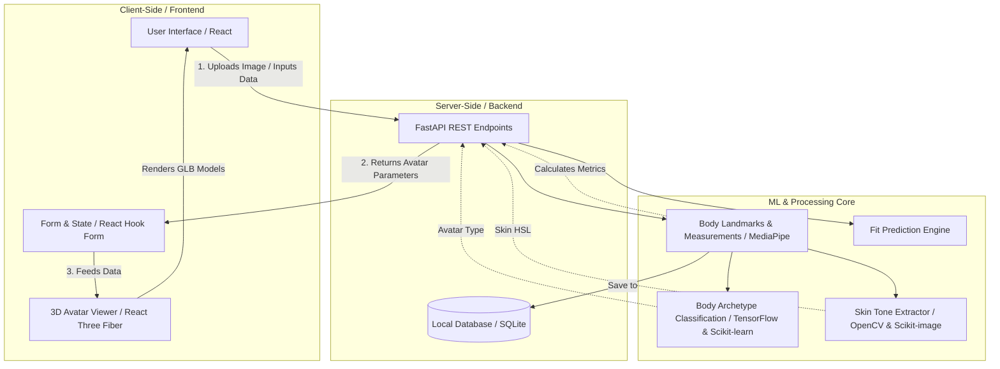

# System Architecture Diagram

```mermaid
graph TD
    subgraph Frontend [Client-Side / Frontend]
        UI[User Interface / React]
        Three[3D Avatar Viewer / React Three Fiber]
        State[Form & State / React Hook Form]
    end

    subgraph Backend [Server-Side / Backend]
        API[FastAPI REST Endpoints]
        DB[(Local Database / SQLite)]
    end

    subgraph MLEngine [ML & Processing Core]
        Pose[Body Landmarks & Measurements / MediaPipe]
        Classify[Body Archetype Classification / TensorFlow & Scikit-learn]
        Skin[Skin Tone Extractor / OpenCV & Scikit-image]
        Fit[Fit Prediction Engine]
    end

    UI -->|1. Uploads Image / Inputs Data| API
    API --> Pose
    Pose --> Classify
    Pose --> Skin
    API --> Fit
    Pose -->|Save to| DB
    
    Pose -.->|Calculates Metrics| API
    Classify -.->|Avatar Type| API
    Skin -.->|Skin HSL| API

    API -->|2. Returns Avatar Parameters| State
    State -->|3. Feeds Data| Three
    Three -->|Renders GLB Models| UI
```
