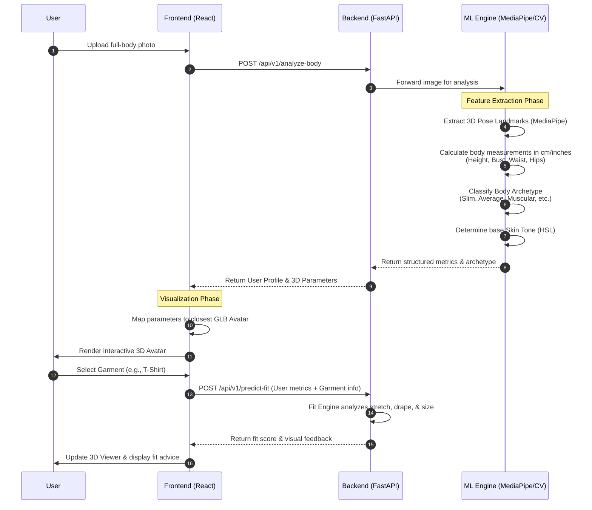

# Application Process & Feature Extraction Flow

```mermaid
sequenceDiagram
    autonumber
    participant U as User
    participant F as Frontend (React)
    participant B as Backend (FastAPI)
    participant M as ML Engine (MediaPipe/CV)

    U->>F: Upload full-body photo
    F->>B: POST /api/v1/analyze-body
    B->>M: Forward image for analysis
    
    Note over M: Feature Extraction Phase
    M->>M: Extract 3D Pose Landmarks (MediaPipe)
    M->>M: Calculate body measurements in cm/inches<br/>(Height, Bust, Waist, Hips)
    M->>M: Classify Body Archetype<br/>(Slim, Average, Muscular, etc.)
    M->>M: Determine base Skin Tone (HSL)
    
    M-->>B: Return structured metrics & archetype
    B-->>F: Return User Profile & 3D Parameters
    
    Note over F: Visualization Phase
    F->>F: Map parameters to closest GLB Avatar
    F->>U: Render interactive 3D Avatar
    
    U->>F: Select Garment (e.g., T-Shirt)
    F->>B: POST /api/v1/predict-fit (User metrics + Garment info)
    B->>B: Fit Engine analyzes stretch, drape, & size
    B-->>F: Return fit score & visual feedback
    F->>U: Update 3D Viewer & display fit advice
```
